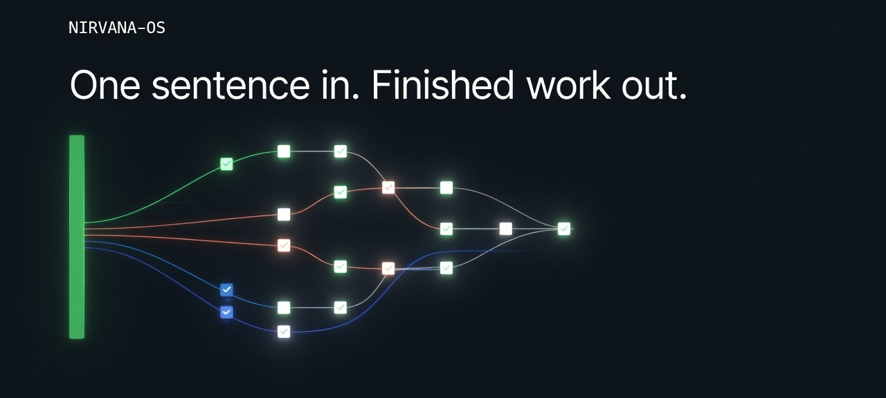
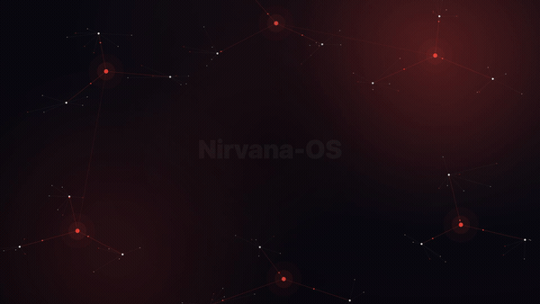

<div align="center">



# Nirvana-OS

**चलाने के लिए तैयार एजेंटिक ऑपरेशंस।** एक वाक्य अंदर। तैयार काम बाहर।

[](https://www.npmjs.com/package/@nirvana-os/cli)
[](https://github.com/gutomec/nirvana-os-engine/stargazers)
[](./CHANGELOG.md)
[](https://github.com/gutomec/nirvana-os-engine/actions/workflows/smoke.yml)
[](./LICENSE)
[](https://www.npmjs.com/package/@nirvana-os/cli)

```bash
npx @nirvana-os/cli
```

एक कमांड इंजन को इंस्टॉल करती है और उसे हर उस टर्मिनल एजेंट से जोड़ देती है जो उसे मिलता है। इसे कभी भी दोबारा चलाना सुरक्षित है।

[दस्तावेज़ीकरण](https://gutomec.github.io/nirvana-os-engine/) · [Packs](https://squads.sh/pt/packs) · [सचित्र इंस्टॉल](https://gutomec.github.io/nirvana-os-engine/install.html) · [Changelog](./CHANGELOG.md)

**इसे अपनी भाषा में पढ़ें:** [English](./README.md) · [Português](./README.pt-BR.md) · [Español](./README.es.md) · [中文](./README.zh.md) · [हिन्दी](./README.hi.md) · [العربية](./README.ar.md)

</div>

---

## आपका एजेंट तेज़ है। वह अकेला भी है।

आप पहले से एक टर्मिनल एजेंट चलाते हैं: Claude Code, Codex, Gemini-CLI या Antigravity। एक प्रॉम्प्ट से एक अच्छा जवाब मिलता है। असली काम एक प्रॉम्प्ट नहीं है। वह एक शोधकर्ता, एक लेखक, एक समीक्षक और एक ऑपरेटर हैं जो एक ही दिशा में, समानांतर, हर कदम के रिकॉर्ड के साथ खिंचते हैं। आज, गोंद आप हैं।

Nirvana-OS उस अकेले एजेंट को एक माएस्ट्रो बना देता है जो पूरे संगठन चलाता है। आप परिणाम को सादे गद्य में बताते हैं। इंजन ब्रीफ़ पढ़ता है, आपके पास जो है उसे देखता है, कंपनियों, squads और mind-clones को समानांतर में डिस्पैच करता है, एक क्वालिटी गेट के पीछे सब कुछ समेटता है, और हर डिस्पैच का ऑडिट ट्रेल लिखता है। आप ऑपरेटर होना छोड़ देते हैं और निदेशक बन जाते हैं।

पूरा इंटरफ़ेस गद्य और एक रसीद है। आप बोलते हैं। आपका एजेंट कमांड चलाता है।

## यह क्या है

Nirvana-OS एक Bun-नेटिव, रनटाइम-अज्ञेय मल्टी-एजेंट ऑपरेटिंग सिस्टम है। यह एक समूह (conglomerate) बनाता, प्रबंधित और संचालित करता है: कितनी भी कंपनियाँ और squads, ब्रीफ़ से सत्यापित डिलिवरेबल तक ऑर्केस्ट्रेट किए गए। यह आपके टर्मिनल एजेंट के ऊपर की ऑर्केस्ट्रेशन परत है, उसका विकल्प नहीं।

डिफ़ॉल्ट **शून्य-मानव** है: बिज़नेस स्वायत्त रूप से चलते हैं, और मानवीय इनपुट मैनिफ़ेस्ट में स्पष्ट ट्रिगर के ज़रिए opt-in होता है। आप परिणाम बताते हैं। इंजन कास्ट चुनता है।

यह जो कुछ भी बनाता है वह तीन चीज़ों में से एक है:

| स्तंभ | यह क्या है | यह कहाँ रहता है |
|---|---|---|
| **कंपनियाँ (businesses)** | स्थायी कर्मचारियों के संगठन चार्ट वाले स्वायत्त संगठन, जो squads को बुलाते हैं | `~/businesses/` |
| **Squads** | पोर्टेबल एजेंट टीमें जो असली workflows चलाती हैं: DAG, क्वालिटी गेट, एस्केलेशन | `~/squads/` |
| **Mind-clones** | 5 परतों में पर्सोना DNA, कर्मचारियों में इंजेक्ट किया गया ताकि वे किसी मास्टर की पद्धति से सोचें और बोलें | `~/businesses/_library/dna/` |

एक कंपनी कर्मचारियों को ऑर्केस्ट्रेट करती है। एक कर्मचारी squads को बुलाता है। एक squad एजेंट चलाता है। एक mind-clone इनमें से किसी को भी अधिक सच्ची आवाज़ देता है। एक ब्रीफ़ इनमें से कई को एक साथ जुटा सकता है।

## क्विकस्टार्ट

आपको चाहिए: [Bun](https://bun.sh) 1.0 या नया। Node 18+ और `tar` सिर्फ़ इसलिए हैं ताकि `npx` काम करे, और ज़्यादातर मशीनों पर वे पहले से हैं।

```bash
# macOS / Linux
curl -fsSL https://bun.sh/install | bash
exec $SHELL
npx @nirvana-os/cli

# Windows (नेटिव, बिना WSL), PowerShell में
powershell -c "irm bun.sh/install.ps1 | iex"
# PATH रिफ़्रेश होने के लिए एक नई PowerShell विंडो खोलें
npx @nirvana-os/cli
```

इंस्टॉलर एक अकेला skills ट्री `~/.nirvana/skills` पर रखता है, उसे `~/.claude`, `~/.codex`, `~/.gemini` और `~/.antigravity` से जहाँ भी वे मिलें जोड़ देता है, और `nrv` बाइनरी को आपके PATH पर रख देता है। यह इंजन इंस्टॉल करता है और कोई कंटेंट नहीं: आपकी रजिस्ट्रियाँ डिज़ाइन से खाली शुरू होती हैं, इसलिए उनमें जो कुछ है वह आपने बनाया है या इंस्टॉल करने के लिए चुना है। इंस्टॉलर को दोबारा चलाना idempotent है और हमेशा नवीनतम इंजन खींचता है।

पुष्टि करें कि इंस्टॉल ठीक है:

```bash
nrv doctor
```

Windows पर, `nrv doctor` यूज़र PATH में उन अस्थायी `nrv-*` एंट्रीज़ की भी जाँच करता है जो 0.8.0 तक के इंजन छोड़ सकते थे। `nrv install --repair-path` उन्हें बिना कुछ लिखे सूचीबद्ध करता है; `--apply` ठीक उन्हीं को हटाता है और बाकी हर एंट्री को जैसी है वैसी रखता है।

फिर अपना एजेंट खोलें और कहें **"Nirvana-OS का उपयोग करके…"**। एजेंट-चालित सेटअप के लिए, अपने रनटाइम को [`AGENT-QUICKSTART.md`](./AGENT-QUICKSTART.md) की ओर इंगित करें।

## 90 सेकंड का डेमो

> **स्लॉट आरक्षित।** कैननिकल 90 सेकंड का वॉकथ्रू प्रकाशित होते ही यहाँ एम्बेड होगा। तब तक, यह एक गद्य आदेश के एक समूह को जोड़ने का लाइव दृश्य है।

<div align="center">
  
</div>

<!-- DEMO-90s SLOT
     Canonical 90-second demo goes here when published (trace 75fbfbcc, phase X3).
     Replace the block above with:
     <a href="VIDEO_URL"></a>
-->

## इसे काम करते देखें: सब कुछ एक वाक्य है

**उसका वर्णन करके एक कंपनी बनाएँ।** सिस्टम संगठन डिज़ाइन करता है, हर कर्मचारी लिखता है, workflows जोड़ता है, और परिणाम को Business Protocol के विरुद्ध मान्य करता है।

```text
Use Nirvana-OS to create a company called podcast-empire that produces, publishes,
and monetizes 3 podcasts at once. Each show has its own niche, an AI host, an
editorial calendar, and an independent monetization funnel. Around 7 employees.
```

**गद्य में एक विशेषज्ञ को क्लोन करें।** जीनियस फैक्ट्री किसी व्यक्ति के सार्वजनिक कार्य-संग्रह से 5 परतों का DNA (दर्शन, मानसिक मॉडल, ह्यूरिस्टिक्स, फ्रेमवर्क, पद्धतियाँ) निकालती है, हर आइटम अपने स्रोत तक उद्धृत।

```text
Use Nirvana-OS to turn the public work of <author> into a complete AI mind-clone
through the genius factory.
```

**एक वाक्य, एक साथ कई टीमें।** एक अकेला ब्रीफ़ एक research squad, एक copy squad और एक design कंपनी को समानांतर में खींच सकता है, एक ही क्वालिटी गेट के पीछे समेटे गए, और ऑडिट ट्रेल माएस्ट्रो का हर चुनाव दिखाता है।

```text
Use Nirvana-OS to produce a launch package: market research, landing-page copy,
and a competitive teardown.
```

और फ़्लो, जिनमें तीन सवालों में "एजेंसी डिज़ाइन करो, विशेषज्ञों को क्लोन करो, उसे बनाओ" शामिल है, [दस्तावेज़ीकरण होम](https://gutomec.github.io/nirvana-os-engine/) पर हैं, जो वही वाक्य सातों समर्थित रनटाइम में चलाता है: Claude Code, Codex, Gemini, Antigravity, Grok, Kimi और Hermes।

## यहाँ "काम हो गया" का मतलब कुछ क्यों है

मल्टी-एजेंट सिस्टम में भरोसे की समस्या है: एक ऑर्केस्ट्रेटर अपने अंतिम संदेश में कुछ भी घोषित कर सकता है। Nirvana-OS तीन गारंटियों से जवाब देता है, हर एक के पीछे एक ऐसा तंत्र है जिसे आप डिस्क पर खोलकर देख सकते हैं।

- **ट्रेस करने योग्य।** हर क्रिया `~/.harness-logs/<date>/audit.jsonl` में एक append-only इवेंट बन जाती है: ब्रीफ़ मिला, डिस्पैच, mind-clone इंजेक्ट हुआ, गेट पास या फ़ेल। हर `--exec` रन, `standard` मोड में या Gauntlet के ज़रिए, प्रोजेक्ट के `.nirvana/run-kernel.sqlite` में एक कैननिकल Run भी छोड़ता है, एक append-only जर्नल जिसे Glance पढ़ता है। इन इवेंट्स के बिना, कोई भी पूर्णता संदेश ईमानदार नहीं है।
- **परखा हुआ।** `verify-deliverable.ts` ब्रीफ़ ने जो वादा किया उसकी तुलना डिस्क पर जो वास्तव में मौजूद है उससे करता है। `quality-gate.ts` फ़ाइल प्रकार के अनुसार rubrics को जज, क्रिटीक और रिवाइज़ के लूप में चलाता है। verify का PASS नहीं, तो वैध पूर्णता नहीं।
- **अनुबंधित।** Tasks के स्वीकृति मानदंड बाइनरी हैं। Capabilities के इनपुट और आउटपुट टाइप किए हुए हैं। क्लाइंट को जाने वाला आउटपुट एक अनुमोदन श्रृंखला से गुज़रता है: निर्माता, फिर समीक्षक, फिर अनुमोदक। बजट एक कठोर सीमा है, और एस्केलेशन ट्रिगर ठीक-ठीक तय करते हैं कि मानव लूप में कब आता है।

## इंजन मुफ़्त, कंटेंट सशुल्क

इस रेपो का इंजन मुफ़्त है, न कोई अपंग टियर और न ही कोई बुनियादी चीज़ ताले में। यह शून्य से कंपनियाँ, squads और mind-clones बनाता और ऑर्केस्ट्रेट करता है। स्रोत [Sustainable Use License](./LICENSE) के तहत प्रकाशित और खुले तौर पर पठनीय है (source-available, OSI-अनुमोदित नहीं; कुछ व्यावसायिक उपयोगों के लिए अलग लाइसेंस चाहिए)।

सशुल्क परत **कंटेंट है, क्षमता नहीं**: क्यूरेटेड, चलाने के लिए तैयार संग्रह, [squads.sh](https://squads.sh) के ज़रिए डिलिवर किए गए। packs आपके लिए जो फ़र्क खरीदते हैं वह समय है, ताक़त नहीं। उन्हें **[squads.sh/pt/packs](https://squads.sh/pt/packs)** पर देखें। फ़्लैगशिप, **[Genesis Circle](https://squads.sh/pt/nirvana-os)**, एक पूरा समूह देता है जिसे आप पहले दिन चला सकते हैं, `nrv update <pack>` से अद्यतन रखा हुआ।

| | मुफ़्त इंजन (यह रेपो) | Packs ([squads.sh/pt/packs](https://squads.sh/pt/packs)) |
|---|---|---|
| शून्य से बनाना | हाँ | हाँ |
| समानांतर में ऑर्केस्ट्रेट करना | हाँ | हाँ |
| हर डिस्पैच पर ऑडिट ट्रेल | हाँ | हाँ |
| पहले से बने squads, कंपनियाँ, mind-clones | कोई नहीं, डिज़ाइन से खाली | पहले दिन से एक पूरा समूह |

## मुट्ठी भर कमांड जो खुद टाइप करने लायक हैं

| आप टाइप करते हैं | यह क्या करता है |
|---|---|
| `npx @nirvana-os/cli` | इंजन इंस्टॉल या अपडेट करता है (idempotent) |
| `nrv glance` | वेब कॉकपिट: कंपनियाँ, squads, clones, ऑडिट, लागत। एक अपनाए गए प्रोजेक्ट में, चैट का एक Message एक चाइल्ड प्रोसेस में असली डिस्पैच चलाता है, लाइव टाइमलाइन, रद्द करने और रीस्टार्ट के बाद रिकवरी के साथ। `--read-only` इसे सिर्फ़ ब्राउज़ तक रखता है |
| `nrv list-businesses` / `nrv list-squads` / `nrv list-clones` | तीनों रजिस्ट्रियाँ ब्राउज़ करता है |
| `nrv search "<topic>"` | तीनों रजिस्ट्रियों में capabilities खोजता है |
| `nrv dispatch --business <slug> \| --squad <slug> \| --agent-x "<brief>" --exec` | आपके नामित लक्ष्य के विरुद्ध एक ब्रीफ़ चलाता है; राउटर से कभी नहीं पूछा जाता |
| `nrv run <business> "<brief>" --execution-mode=gauntlet --gauntlet-intensity=light\|balanced\|exhaustive` | Gauntlet में opt-in करता है: तीन तीव्रताओं में उम्मीदवार, मूल्यांकन और संशोधन दौर (Business लक्ष्यों को `NIRVANA_BUSINESS_GAUNTLET_ALLOWLIST` चाहिए) |
| `nrv multi-target plan\|run\|status <plan.json>` | Run Kernel के ऊपर एक multi-target प्लान को कंपाइल, निष्पादित या निरीक्षण करता है (`NIRVANA_MULTI_TARGET_KILL_SWITCH=1` `run` को बंद करता है) |
| `nrv validate <squad\|business\|clone> <slug> [--fix]` | एक एंटिटी का प्रवेश द्वार, या `--all` से हर इंस्टॉल की हुई एंटिटी; `--fix` जो ठीक हो सकता है उसे ठीक करता है, कुछ गढ़ता नहीं |
| `nrv migrate <slug> --to 6 [--apply]` | एक squad को Squad Protocol 6.0 में बदलता है; डिफ़ॉल्ट dry run है, `--apply` बैकअप के साथ लिखता है |
| `nrv update <pack>` | एक इंस्टॉल किया हुआ pack अपडेट करता है |
| `nrv doctor` | इंस्टॉलेशन जाँचता है; Windows पर, `nrv install --repair-path` उन यूज़र PATH एंट्रीज़ को साफ़ करता है जिनके बारे में यह चेतावनी देता है |

बाकी सब कुछ आपका एजेंट चलाता है। पूरा संदर्भ: [docs/CLI.md](./docs/CLI.md)।

## FAQ

**क्या मुझे कोड करना आना चाहिए?** नहीं। आप सादी भाषा में परिणाम बताते हैं; सिस्टम कोड लिखता, मान्य करता और चलाता है।

**क्या यह मेरे एजेंट की जगह लेता है?** नहीं। यह Claude Code, Codex, Gemini-CLI या Antigravity के ऊपर चलता है, और आपके पास जो एक है उससे कई को ऑर्केस्ट्रेट करवाता है।

**मेरा काम कहाँ रहता है?** आपकी मशीन पर, `~/businesses`, `~/squads` और `~/businesses/_library/dna` के अंतर्गत। Local-first, लूप में कोई तृतीय-पक्ष क्लाउड नहीं।

**अगर सिस्टम वह न कर सके जो मैं माँगूँ?** वह बता देता है। जिस ब्रीफ़ से कुछ मेल नहीं खाता उसे इनकार मिलता है और साथ में लापता capability बनाने का सुझाव। अस्पष्ट ब्रीफ़ को वापस एक सवाल मिलता है, शीर्ष उम्मीदवारों के साथ।

**Windows?** नेटिव, Bun के ज़रिए। WSL की ज़रूरत नहीं।

## लाइसेंस, लेखकत्व और स्थिति

लेखक: **Luiz Gustavo Vieira Rodrigues (gutomec / Prospecteezy)**। कोई सह-लेखक नहीं।

लाइसेंस: Nirvana-OS Sustainable Use License (SUL) v1.0। स्रोत प्रकाशित और खुले तौर पर पठनीय है, और इंजन उपयोग के लिए मुफ़्त है। यह source-available है, OSI-अनुमोदित ओपन-सोर्स लाइसेंस नहीं, और कुछ व्यावसायिक उपयोगों के लिए अलग व्यावसायिक लाइसेंस चाहिए। किसी भी सारांश पर, इस पर भी, भरोसा करने से पहले [LICENSE](./LICENSE) पढ़ें।

स्थिति: beta (0.x, अभी 0.10.0)। इंजन आज काम करता है और मिनटों में इंस्टॉल होता है। 1.0 तक सतह के बदलते रहने की उम्मीद रखें।
