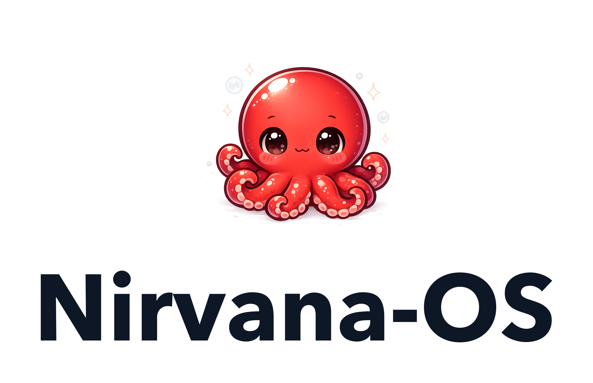

<div align="center">

<picture>
  <source media="(prefers-color-scheme: dark)" srcset="docs/assets/logo/lockup-stacked-dark.png">
  
</picture>

# Nirvana-OS

**The operating system for agentic work.** A local-first, runtime-agnostic control plane for building and running AI agent teams, multi-agent companies, and specialist personas, then dispatching real work to them from any AI CLI you already use.

[](LICENSE)
[](https://bun.sh)
[](#supported-runtimes)

</div>

---

## What it is

Nirvana-OS is the open-core engine for agentic work. It gives you three primitives and the machinery to run them:

- **Squads** — portable teams of AI agents with workflows, gates, and a shared protocol (Squad Protocol v5).
- **Businesses** — multi-agent organizations with an org chart, employees, and escalation (Business Protocol v1).
- **Mind-clones** — specialist personas with their own knowledge and voice, callable on their own or inside a squad.

You build these by talking to your AI CLI in plain language. The engine validates them, indexes them, and routes your briefs to the right one. Everything runs on your machine and writes to an append-only audit log.

The engine is free and source-available. It ships **empty**: no pre-built squads, businesses, or mind-clones. Curated content (the Genesis Circle bundle and future packs) is sold separately at [squads.sh](https://squads.sh) and installs on top of the same engine. See [packs](#packs).

---

## Install

```bash
npx @nirvana-os/cli
```

The installer is a thin launcher. It fetches the latest engine, ensures [Bun](https://bun.sh) is present, copies the skills tree to `~/.nirvana/skills`, links every agent runtime it detects, and wires audit hooks. Re-running is safe and idempotent.

**Requirements:** Node ≥ 18 and `tar` (only for the installer to run via `npx`), Bun ≥ 1.0 (the runtime everything else uses), and at least one supported agent CLI.

Prefer to install from source? See [INSTALL.md](INSTALL.md) for the clone-and-build path.

---

## Supported runtimes

One shared tree at `~/.nirvana/skills` is consumed by every runtime on your machine. Runtimes you do not have installed are skipped, and you can re-run the installer after adding one.

| Runtime | How it connects | Audit hooks |
|---|---|---|
| Claude Code | symlinks in `~/.claude/skills` | yes |
| Gemini-CLI | symlinks in `~/.gemini/skills` | yes |
| Antigravity (`agy`) | symlinks in `~/.antigravity/skills` | yes |
| Codex | symlinks in `~/.codex/skills` | no (audit via session transcripts) |
| Hermes | bridge via `external_dirs` in `~/.hermes/config.yaml` | opt-in |

---

## Quickstart

After installing, open any supported AI CLI and brief it in plain language. The harness routes the brief to the best-matching capability, runs it, and verifies the result.

```text
Create a squad that turns a long PDF into a clean, structured summary.
```

Build the three primitives the same way:

```text
Create a mind-clone of a senior brand strategist with a sharp, contrarian voice.
Design a business that runs competitive-intelligence research on a schedule.
```

Drive it directly with the CLI when you want the throttle:

```bash
nrv validate          # smoke-test the install and registries
nrv list-squads       # what is in your library
nrv glance            # open the web cockpit (live runs + capability graph + audit trail)
nrv init ~/my-project # scaffold a project the agents will discover
```

Full command reference: [docs/CLI.md](docs/CLI.md).

---

## How it works

```
brief (plain language)
      │
      ▼
  harness ── routes ──▶ business ──▶ squad ──▶ agent / mind-clone
      │                                              │
      ▼                                              ▼
  audit log (append-only, per-trace)          deliverable on disk
```

The engine is four skills under one shared tree:

- **harness** — dispatch, routing, the `nrv` CLI, and the Glance cockpit.
- **squads** — create, validate, inspect, and migrate squads.
- **businesses** — create, validate, and manage companies and org charts.
- **_shared** — mind-clone tooling, schemas, validators, and runtime adapters.

Because the tree is shared and the audit log is local, the same capabilities work identically across runtimes, survive the removal of any single CLI, and leave a verifiable trail of every action.

---

## Packs

The engine creates capabilities from scratch. Packs are curated, ready-to-run collections that install on top of it:

- **Genesis Circle** — a founding library of squads, businesses, and mind-clones.
- Future packs follow the same shape and install the same way.

Packs are delivered per-buyer from [squads.sh](https://squads.sh). The engine in this repository never contains pack content.

---

## License

Released under the **Sustainable Use License (SUL) v1.0**. Use it, modify it, and build commercial work with it, including revenue-generating projects, as long as you do not resell Nirvana-OS itself as a hosted service. Running it as a managed service or SaaS for third parties needs a separate commercial license. Full terms in [LICENSE](LICENSE). The SUL is source-available, not OSI-approved.

---

## Author

**Luiz Gustavo Vieira Rodrigues** ([@gutomec](https://github.com/gutomec)), creator of the Nirvana-OS Project, Brazil.
