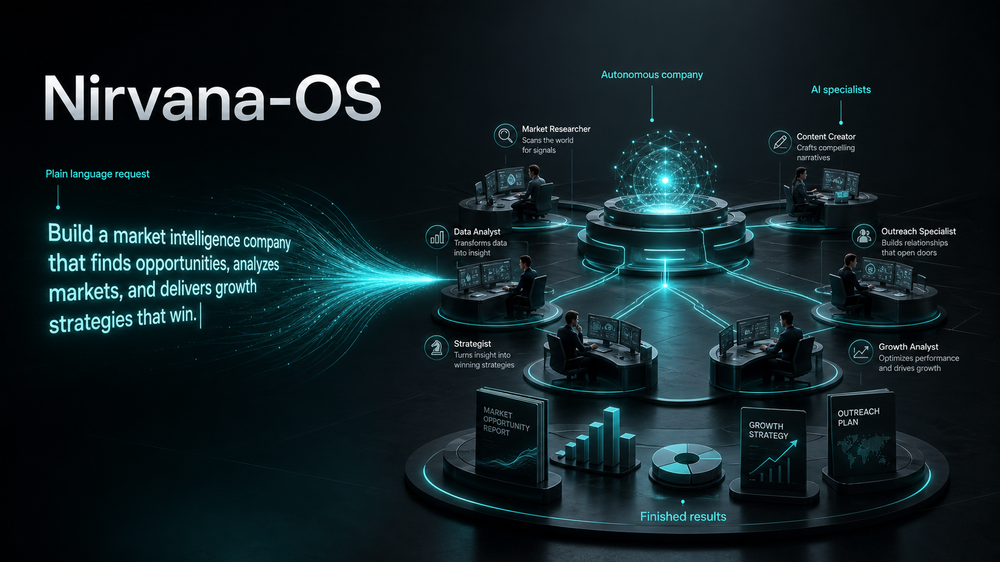

# Nirvana-OS engine



[](#license-authorship-and-status)
[](https://github.com/gutomec/nirvana-os-engine/actions/workflows/smoke.yml)
[](./LICENSE)
[](https://www.npmjs.com/package/@nirvana-os/cli)
[](./CHANGELOG.md)

**Read this in your language:** [English](./README.md) · [Português](./README.pt-BR.md) · [Español](./README.es.md) · [中文](./README.zh.md) · [हिन्दी](./README.hi.md) · [العربية](./README.ar.md)

> **For your agent:** point your terminal agent (Claude Code, Codex, Gemini, Antigravity) at
> [`AGENT-QUICKSTART.md`](./AGENT-QUICKSTART.md) — one page that teaches it how to drive
> Nirvana-OS: the activation phrase, the orchestrator contract, and how to prove execution.

---

## Command a universe of companies in plain language

You already have a terminal agent. Claude Code, Codex, Gemini-CLI, or Antigravity. It is sharp, and it is alone.

Nirvana-OS turns that single agent into a maestro that runs **whole companies**. You describe what you want in plain prose, and the system stands up the organizations, the specialist teams, and the expert minds to deliver it, many of them at once, with a receipt for every step.

```bash
npx @nirvana-os/cli
```

One command. It installs the engine, links into every agent runtime it finds, and is safe to run again any time. Nothing else to configure.

And here is the rule this page keeps proving, section by section: **you talk, your agent runs the commands.** The handful worth typing yourself fits in one short table.

## You don't need another chatbot. You need an organization that does the work.

A single agent answers a prompt. Real work is not one prompt. It is a researcher, a writer, a reviewer, and an operator pulling in different directions, coordinated, with a paper trail. Today you are the glue: you run prompt after prompt by hand and stitch the pieces together yourself, with no record of who did what.

Nirvana-OS removes you from the glue. You state the outcome in prose. The engine reads it, consults what you have, dispatches the right combination of companies and squads, runs them in parallel, reconciles the result behind a quality gate, and writes down every dispatch. You go from operator to director: you state the goal and inspect the result.

## Who this is for

A small, specific audience, on purpose: developers and operators who already run a terminal agent and have noticed that the bottleneck moved. One good answer is easy now. An organization's worth of coordinated work, with proof of who did what, is still hard, and that is the problem this engine removes. Nirvana-OS does not replace your agent. It promotes it.

## What it is, in one breath

Nirvana-OS is a Bun-native multi-agent operating system that creates, manages, and administers a conglomerate: any number of companies and/or squads, orchestrated from brief to verified deliverable. It is the orchestration layer **above** your terminal agent, not "a company that builds companies", and it works in three materials, all shaped by natural language:

- **Companies (businesses):** autonomous organizations with an org chart of employees. Each employee calls squads. They live in `~/businesses/`.
- **Squads:** portable teams of agents that run real workflows (DAG, gates, escalation) and ship finished deliverables. They live in `~/squads/`.
- **Mind-clones:** persona DNA in 5 layers, injected into employees so they think and speak with a master's method. They live in `~/businesses/_library/dna/`.

One request can mobilize many of them at the same time. The orchestrator (the `harness`) picks the cast. You just describe the outcome.

## See it work: everything is a sentence

This is the part that matters. You do not write code, fill in forms, or edit config. You talk to the system, inside the AI runtime you already use, by naming it: **"use Nirvana-OS to…"**. Here is what that looks like.

### 1. Build a company by describing it

Give it the hierarchy and the roles in prose. It designs the org, writes every employee, wires the workflows, and validates the result.

```text
Use Nirvana-OS to create a company called podcast-empire that produces, publishes,
and monetizes 3 podcasts at once. Each show has its own niche, an AI host, an
editorial calendar, and an independent monetization funnel. Around 7 employees.
```

The system runs its business factory: intent reading, domain research, an org blueprint you approve, then employees, memory, and workflows, validated against the Business Protocol. You end up with `~/businesses/podcast-empire/`, staffed and ready to run.

### 2. Or let the system design the company for you

Don't know the right structure yet? Ask. This is the flow most people fall in love with.

**Step one, ask for the design:**

```text
Use Nirvana-OS: how would a complete, modern marketing agency be structured?
Give me the hierarchy, the key roles, and who the best specialists in the world
are for each seat.
```

The system answers with a real org chart: a creative director, a head of performance, a copy chief, a content lead, a strategist, and the names of the operators whose methods each seat should embody.

**Step two, clone those specialists:**

```text
Great. Clone those specialists into mind-clones I can hire.
```

It runs the mind-clone factory and produces persona DNA for each one, the thinking, heuristics, and voice of that kind of operator.

**Step three, build the company with them in the seats:**

```text
Now build the agency, and put those clones in the matching roles as the
brains of each employee.
```

It assembles the business, assigns each mind-clone to the right employee, and creates any specialist squad the agency needs but doesn't have yet. You asked three questions in plain English and got a staffed company.

### 3. Create a specialist squad in prose

When a company needs a capability no existing team covers, describe the team you want.

```text
Use Nirvana-OS to generate a squad for headless e-commerce automation, with
agents for catalog, checkout, inventory, and support. Validate it against the
Squad Protocol.
```

Out comes `~/squads/…/` with agents, tasks, workflows, schemas, a harness config, and a README, all validated.

### 4. Clone an expert in prose

Turn anyone's public body of work into an advisor your employees can use.

```text
Use Nirvana-OS to turn the public work of <author> into a complete AI mind-clone
through the genius factory.
```

The factory extracts a 5-layer DNA (philosophies, mental models, heuristics, frameworks, methodologies), builds the persona, runs it through a panel of other minds, and delivers an advisor you can drop into any company.

### 5. One sentence, many teams at once

The orchestrator is happy to mobilize several companies and squads from a single brief.

```text
Use Nirvana-OS to produce a launch package: market research, landing-page copy,
and a competitive teardown.
```

That one line can pull a research squad, a copy squad, and a design company in parallel, each staffed by employees carrying the right mind-clones, reconciled behind a single quality gate. You did not pick any of them. The maestro did, and the audit trail shows its choices.

> The whole interface is prose plus a receipt. No API calls, no config files. Describe the outcome, then read the audit trail that proves what happened.

Which leaves one practical question. How do you say all this to *your* agent? Install first; that takes a minute.

## Install in 60 seconds

Same idea on every OS: install Bun once, then run one command.

What you need: Bun 1.0 or newer runs everything. Node 18 or newer and `tar` exist only so `npx` works; most machines already have them. Python 3.10 or newer is optional, needed only for `nrv export --pdf` and `--zip`.

### macOS / Linux

```bash
curl -fsSL https://bun.sh/install | bash
exec $SHELL                # reload PATH, or just open a new terminal
npx @nirvana-os/cli        # installs the engine
```

### Windows (native, no WSL)

The whole system runs on Bun, so Windows needs only Bun. In **PowerShell**:

```powershell
powershell -c "irm bun.sh/install.ps1 | iex"
# open a NEW PowerShell window so PATH refreshes
npx @nirvana-os/cli
```

### What the installer actually does

It places a single skills tree at `~/.nirvana/skills`, links it into `~/.claude`, `~/.codex`, `~/.gemini`, and `~/.antigravity` wherever it finds them, and puts the `nrv`, `nrv-gemini`, and `nrv-hermes` binaries in `~/.local/bin` (`%USERPROFILE%\.local\bin` on Windows), on your PATH automatically. It installs the engine and no content. Re-running `npx @nirvana-os/cli` is idempotent and always pulls the latest engine.

To confirm the install is healthy:

```bash
nrv doctor
```

Then open your agent and say **"use Nirvana-OS to…"**. The next section shows exactly what that looks like in each runtime.

## How to ask your agent, runtime by runtime

There is no Nirvana-OS app to open. You talk to the agent you already use, and one phrase wakes the system: **"use Nirvana-OS to…"**. Variants work too: "via Nirvana", "orchestrate through Nirvana", "use my companies", "use my squads". The phrase triggers the `harness` skill. That skill is the maestro.

| Runtime | Link status | How you ask |
|---|---|---|
| Claude Code | Always linked | Prose, in your chat. The agent invokes the harness itself. |
| Codex | Linked if present | Same: prose, in-process. |
| Antigravity (`agy`) | Linked if present | Same: prose, in-process. |
| Hermes | Opt-in bridge | `hermes chat`, then prose. Or one-shot with `hermes -z`. |
| Gemini-CLI | Linked if present | Sub-process via `nrv dispatch` (legacy, being sunset). |

In detail:

- **Claude Code, Codex, Antigravity (in-process):** you write the sentence and nothing else. The agent invokes `Skill("harness", "<your brief>")` itself, or activates the skill by matching its description. You never leave the conversation.
- **Hermes:** run `hermes chat` and ask in prose. For a one-shot, `hermes -z "use the nirvana-os skill: <brief>"`. The bridge calls `nrv dispatch` for you.
- **Gemini-CLI (legacy):** the engine drives it as a sub-process through `nrv dispatch`. It works, and it is on its way out.
- **Any project directory:** run `nrv init <dir>` once. It writes an `AGENTS.md` contract, with byte-identical `CLAUDE.md` and `GEMINI.md` copies, so any agent that opens the directory discovers the harness on its own.

### The system suggests. You decide.

You do not need to memorize what you have installed. In agentic mode, the default, the maestro reasons over the three registries: companies, squads, mind-clones. A clean match gets dispatched. An ambiguous brief gets a question back, with the top candidates and their descriptions, so you choose with context. No match at all gets a refusal plus a suggestion to create the missing capability, never a fake attempt.

Mind-clone selection follows a fixed order: requested, then assigned, then search, then default. And whenever the system picks a clone, it also shows you the alternative candidates it passed over.

Which raises the obvious next question: reasons over *what*, exactly? Look for yourself.

## Look around with `nrv`

The discovery commands are read-only and safe anytime.

```bash
nrv glance            # read-only web cockpit: companies, squads, clones, audit, costs
nrv list-businesses   # organizations registered locally
nrv list-squads       # the agent teams
nrv list-clones       # persona DNA available to inject
nrv search "launch"   # find capabilities across all three registries
```

Run these on a fresh install and you meet the first honest objection to this whole pitch: everything comes back empty.

Good. That is the design, not a defect. The factory is installed; the cargo is not. The engine ships with full power to create and orchestrate and zero pre-built content, so everything in those registries is something you built or chose to install. Nothing arrives that you did not put there.

So what goes in the registries? Three kinds of thing, and only three.

## The three pillars

Everything the engine creates and orchestrates is one of three things. This is the entire mental model.

| Pillar | What it is | Where it lives |
|---|---|---|
| **Companies** | Autonomous organizations, each with an org chart of employees | `~/businesses/` |
| **Squads** | Portable agent teams that run workflows (DAG, gates, escalation) | `~/squads/` |
| **Mind-clones** | Persona DNA injected into employees for voice and judgment | `~/businesses/_library/dna/` |

A company orchestrates employees. An employee calls squads. A squad runs agents. A mind-clone gives any of them a truer voice. A single brief rarely needs just one.

That is what they are. How each one is formed is where the engineering shows.

## Anatomy: how each pillar is formed

Prose is the interface, but nothing underneath is vague. Each pillar is a package with a protocol behind it, and the anatomy is worth two minutes of your time.

### How a squad is formed (Squad Protocol v5)

A squad is a portable package under `squad.yaml`, built from exactly four kinds of parts:

- **Agents:** each persona is one `.md` file with two audiences inside. The YAML frontmatter carries runtime configuration and is read by the machine; the prose body is the system prompt and is read by the model.
- **Tasks:** the unit of work. A task declares inputs, steps, outputs, and acceptance criteria that are binary and verifiable: it passed or it did not. Tasks have no owner.
- **Workflows:** YAML that binds agents to tasks in a DAG. Steps at the same level form a parallel wave. When a runtime cannot spawn subagents, the workflow degrades gracefully to sequential execution.
- **Capabilities:** the v5 discovery layer. Each capability has a dotted hierarchical id (`domain.subdomain.verb`), a description, domains, typed inputs and outputs, examples, a `not_for` list, and an `invoke` contract pointing at a workflow, a task, or an agent.

The rule that holds it together: the capability is what the squad promises, atomic and seen from the outside; the workflow is how; the task is a unit inside.

### How a company is formed (Business Protocol v1)

A business is a package under `business.yaml`, and it is the unit of organizational coherence. Inside:

- **Employees:** persistent specialist agents. Each is a `.md` file whose frontmatter declares `role`, `reports_to`, a `type` (`functional_specialist` or `mind_clone`), and a `self_score_contract`; the body is the system prompt.
- **An org chart:** real hierarchy, not decoration. Alongside it: routing and processes.
- **Memory:** permanent memory for the organization, plus isolated memory per project.
- **Governance:** budgets, escalation triggers, approval chains, and a `culture.md`.

An employee does not hand-craft everything. Before producing any atomic deliverable itself, it asks "is there a squad for this?", calls one or more squads (governed by a `squads_authorized` whitelist; empty means all allowed), and integrates the result back. Work moves between employees through five handoff primitives: mention (`@name`), ticket, escalation (up), delegation (down), and auto-routing.

One structural rule has teeth: a company with more than 5 employees needs an antagonist, a seat whose job is to push back.

### How a mind-clone is formed (5 layers of DNA)

A mind-clone is the distilled method of a real expert, extracted from their public body of work into 5 layers:

1. **L1 Philosophies:** beliefs and axioms.
2. **L2 Mental models:** how the expert structures problems.
3. **L3 Heuristics:** fast tactical rules.
4. **L4 Frameworks:** named systems.
5. **L5 Methodologies:** step-by-step processes.

Every item carries a `^[FONTE:file:section:excerpt]` citation back to the source material, and each build reports its source coverage (94%, for example). The package is concrete: `MANIFEST.yaml`, plus `agent/AGENT.md` (a first-person cognitive emulation), `agent/SOUL.md` (values, fears, contradictions, influences), `agent/DNA-CONFIG.yaml`, and `dna/dna-schema.md` (the 5 layers with their sources).

At runtime the DNA is injected whole into an employee's prompt, with one standing instruction: the clone is fully incorporated, so deliver as if the clone had produced the work. The injection is never silent. It emits a `mind_clone_injected` audit event recording bytes and sha256 for every file injected, so you can prove which mind was in the room. The catalog holds 503 clones, including David Ogilvy, Alex Hormozi, Seth Godin, and Dan Kennedy.

## You can make more of everything: the meta-tools

The engine ships three factories, and they call each other. This is how a company you asked for in one sentence ends up complete.

- **Business Creator** turns a prose brief into a full organization: employees, memory, workflows, validated end to end. When it needs a capability no squad covers, it delegates to the Squad Creator.
- **Squad Creator** turns a prose brief into a validated squad: agents, tasks, workflows, schemas, harness config, README.
- **Genius Factory** turns a person's public work into a 5-layer mind-clone, then hands you an advisor ready to hire.

Meta-tools calling meta-tools is why "design the agency, clone the specialists, build it" works as three plain sentences.

## How it works

Give the harness a brief and it does five things, in order:

1. Reads the brief.
2. Consults the three registries: companies, squads, mind-clones.
3. Dispatches the best combination, which can be many companies and/or squads in parallel.
4. Reconciles the results behind a quality gate.
5. Writes an audit trail to `~/.harness-logs/<date>/audit.jsonl`.

```
                       brief
                         │
                         ▼
                ┌───────────────────┐
                │ harness (maestro) │
                │ read · route ·    │
                │ dispatch          │
                └───────────────────┘
                         │
        consults the three registries
       (companies · squads · mind-clones)
                         │
        ┌────────────────┼────────────────┐
        ▼                ▼                 ▼
 ┌────────────┐   ┌────────────┐    ┌──────────────┐
 │  company A │   │  squad X   │    │  mind-clones │
 │ employees  │   │  workflow  │◀───│  injected as │
 │  → squads  │   │  DAG·gates │    │  persona DNA │
 └────────────┘   └────────────┘    └──────────────┘
        │                │
        └───── parallel dispatch ──────┘
                         │
                         ▼
                ┌───────────────────┐
                │   quality gate    │
                │ reconcile output  │
                └───────────────────┘
                         │
            ┌────────────┴────────────┐
            ▼                         ▼
       final result        ~/.harness-logs/<date>/audit.jsonl
                            (every dispatch, on the record)
```

Parallelism is the wedge: one brief can put several teams to work in the same run and reunite their output at the end. The audit trail is the trust: open the log and trace which agents ran, on which brief, in what order, and why. Agentic work stops being a black box.

A diagram is a claim. Three guarantees enforce it.

## The three seals: traceable, tested, contracted

Multi-agent systems have a trust problem. An orchestrator can announce anything in its final message. Nirvana-OS answers with three guarantees, each backed by a mechanism you can open on disk.

**Traceable.** Every action becomes an append-only event in `audit.jsonl`: `brief_received`, `dispatch_business`, `dispatch_squad`, `mind_clone_injected`, `gate_passed` or `gate_failed`, `verify_passed` or `verify_failed`. The log lives at `~/.harness-logs/<date>/audit.jsonl` and is visible in `nrv glance`. The rule is blunt: without these events, no completion message is honest. The interface is prose plus a receipt.

**Tested.** Two programs stand between a claim and a deliverable. `verify-deliverable.ts` compares disk truth: what the brief promised against what actually exists on disk, flagging anything missing or stubbed. `quality-gate.ts` runs rubrics per file type, in a judge, critique, and revise loop. Without a verify PASS there is no legitimate `gate_passed`. Squads also carry a fidelity contract with ground truth, and employees self-score before every handoff.

**Contracted.** Nothing moves on vibes. Tasks have binary acceptance criteria. Capabilities have typed inputs and outputs; the id is the contract and the implementation stays hidden. Handoffs are structured artifacts of at most 800 tokens. Client-bound output passes an approval chain: producer, then reviewer, then approver. Budgets are a hard ceiling, and escalation triggers define exactly when a human must enter the loop.

Traceable tells you what happened. Tested tells you it is real. Contracted tells you it was allowed. Together they are why "the work is done" means something here.

## Open core: the engine is free, and stays free

The engine in this repo is free, with no crippled tier and nothing basic locked away. It creates and orchestrates companies, squads, and mind-clones from zero. If you want to build your own conglomerate from scratch, the engine is all you ever need and you owe nothing.

That is deliberate. The engine is the whole capability, and giving the whole capability away is how trust gets built: you can verify everything on this page before spending anything.

Free invites a fair question: is it open-source? Be precise here. The source is published and openly readable, but the license is source-available, not OSI-approved open-source, and certain commercial uses require a separate commercial license. The [license section](#license-authorship-and-status) spells it out.

The paid layer is **content, not capability**: curated, ready-to-run collections of squads, companies, and mind-clones, delivered through [squads.sh](https://squads.sh).

| | Free engine (this repo) | Paid packs (squads.sh) |
|---|---|---|
| Create from scratch | Yes | Yes |
| Orchestrate in parallel | Yes | Yes |
| Audit trail on every dispatch | Yes | Yes |
| Multi-runtime install | Yes | Yes |
| Pre-built squads, companies, mind-clones | None, empty by design | A full conglomerate, ready to run |
| Time to a working conglomerate | You build it | Day one |

The difference the packs buy you is **time, not power**. The flagship, **Genesis Circle**, lands 39 production squads, 11 companies, and 159 mind-clones in one install. Packs install on top of the engine and stay current with `nrv update <pack>`. [See the packs on squads.sh](https://squads.sh).

## The `nrv` commands: your agent runs most of them

The CLI exists so the system's own skills and hooks can drive the engine, and so your agent can act on your behalf. In daily use, you speak and your agent types. The genuinely human handful:

| You type | What it does |
|---|---|
| `npx @nirvana-os/cli` | Install or update the engine (idempotent) |
| `nrv glance` | Read-only web cockpit: companies, squads, clones, audit, costs |
| `nrv init <dir>` | Write the `AGENTS.md` contract into a project directory |
| `nrv list-businesses` / `nrv list-squads` / `nrv list-clones` | Browse the three registries (read-only) |
| `nrv search "<topic>"` | Search capabilities across all three registries |
| `nrv update <pack>` | Update an installed pack |
| `nrv doctor` | Check the installation |

Everything else is agent-run or advanced. `Skill("harness", …)` is the in-process entry your agent uses. `nrv dispatch`, `nrv run`, and `nrv auto` drive orchestration from the shell. `nrv ask <clone>` talks to a single mind-clone with its DNA injected; `nrv revise` applies a change to a project in the same runtime session; `nrv audit-view` walks a project's audit chain; `nrv export` packages a project's output (Python 3.10+ needed only for `--pdf` and `--zip`).

Two commands deserve a demotion notice. `nrv route` and `nrv find` are lossy BM25 diagnostics: fine for a quick keyword sniff, never a source of truth. The agentic maestro is the source of truth.

Full reference: [docs/CLI.md](./docs/CLI.md).

## FAQ

**Do I need to know how to code?** No. You describe outcomes in plain language. The system writes, validates, and runs the code.

**Do I have to learn the CLI?** No. Your agent runs most `nrv` commands for you. The human handful is install, `nrv glance`, `nrv init`, the `list-*` trio, `nrv search`, `nrv update`, and `nrv doctor`.

**What if the system can't do what I ask?** It says so. When a brief matches nothing in your registries, the maestro refuses and suggests creating the missing capability. When it is ambiguous, it asks, with the top candidates and their descriptions.

**Does it replace my agent?** No. It runs on top of Claude Code, Codex, Gemini-CLI, or Antigravity, and makes the one you have orchestrate many.

**Where does my work live?** On your machine, under `~/businesses`, `~/squads`, and `~/businesses/_library/dna`. Local-first, with no third-party cloud in the loop.

**Is the engine really free?** Yes. The paid packs are pre-built content that saves you time. The engine builds the same things from scratch at no cost.

**Windows?** Native, through Bun. No WSL required.

## License, authorship, and status

Author: **Luiz Gustavo Vieira Rodrigues (gutomec / Prospecteezy)**. No co-authors.

License: the Nirvana-OS Sustainable Use License (SUL) v1.0. Plain terms, because this is where trust is won or lost: the source is published and openly readable, and the engine is free to use. It is **source-available, not an OSI-approved open-source license**, and certain commercial uses require a separate commercial license. If that distinction matters to your case, read [LICENSE](./LICENSE) before relying on any summary, including this one.

Status: beta (0.x, currently 0.1.58). The engine works today and installs in minutes. Expect the surface to keep moving until 1.0.
