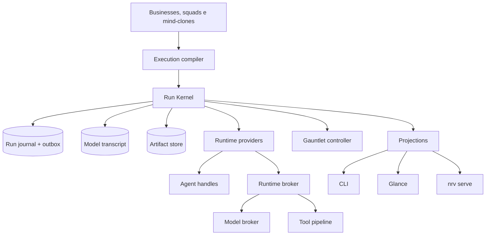

# Arquitetura integrada

## 1. Decisão central

O programa será construído em quatro camadas. O Run Kernel entra primeiro. Runtime universal, Gauntlet Engine e Glance são consumers do kernel. A organização semântica existente permanece acima deles.

```text
Project e brief
  → Business coordenador
    → Employee responsável
      → Squad e capability
        → Workflow, task e agent
          → mind-clone e critérios
            → Run Kernel
              → runtime, model, tools e artifacts
```

Essa ordem preserva o diferencial do Nirvana: quem responde, por que foi escolhido e qual método aplica continuam sendo decisões de businesses, squads e mind-clones. O broker decide como executar uma capability já selecionada. Ele não refaz roteamento de domínio.

## 2. Estado atual confirmado

| Área | Estado existente | Limite observado |
|---|---|---|
| Cascata | Business → Squad → `agent-x` | Validators ainda assumem cadeia empresarial. |
| Squads | Capabilities, agents, tasks e workflows portáteis | Compatibility conhece `declared` e `active` de forma binária. |
| Businesses | Coordenação, employees, DNA e memória | Eventos de delivery carregam forma empresarial mesmo para outros targets. |
| Mind-clones | Método e conhecimento independentes do modelo | Provenance efetiva no prompt ainda é insuficiente. |
| Runtimes | Driver com adapters conhecidos | Identidade e aliases são hardcoded em pontos diferentes. |
| Ledger e audit | SQLite, JSONL, supervisor e salvage | Máquinas de estado podem discordar. |
| Quality gate | Gate, revisão e entrega com reservas | Terminal não distingue aprovação de waiver de modo inequívoco. |
| Glance | Catálogos, runs, DAG, agentes, custos e ações | Runs e estados são inferidos; jobs e chat são efêmeros. |
| `nrv init` | Scaffold seguro, marcado e idempotente | Lógica está acoplada ao script. |

## 3. Arquitetura proposta



### 3.1 Run Kernel

É a autoridade do lifecycle. Registra comandos, valida transições, publica events por outbox, controla scopes, cria handles, versiona artifacts e alimenta projections. Ledger, audit, gates e Glance deixam de competir como fontes de verdade.

### 3.2 Runtime universal

O runtime ativo continua sendo o fallback seguro. A política `active` não exige produtos enumerados. A futura política `negotiate` filtra candidates por capabilities, enforcement, trust, policy, modelo, provider, tools e orçamento. Runtime desconhecido pode executar quando um provider ou bridge prova conformance suficiente.

### 3.3 Gauntlet Engine

É um modo de execução compilado após o brief. Produz contrato de sucesso, estratégia de candidates, gauntlets aplicáveis, orçamento, critérios de seleção e condições de parada. Produtor e evaluator são papéis separados. O modo nunca substitui o quality gate final.

### 3.4 Glance

É o cockpit de Project, Conversation e Run. Cria projetos pelo mesmo `ProjectService` usado por `nrv init`, mantém chat persistente, exibe timeline, DAG, lineage, agents, costs, approvals e artifacts a partir das mesmas projections.

## 4. Fronteiras e invariantes

1. Um broker NÃO PODE substituir a escolha semântica de business ou squad.
2. Mind-clone NÃO É runtime, modelo, provider nem evidência independente por definição.
3. Todo Run possui `target`, `project_id`, `trace_id`, `run_id` e `plan_id` estáveis.
4. Todo evento crítico possui identidade, sequência, causalidade e publicação durável.
5. Todo artifact publicado possui digest, revision, producer e lineage.
6. Authority de child scope só pode diminuir.
7. Provider ou model switch material exige policy e, quando aplicável, aprovação.
8. Gauntlet termina por sucesso, teto, ausência de progresso, regressão, bloqueio ou decisão autorizada.
9. Glance nunca escreve estado projetado diretamente.
10. CLI, Glance e `nrv serve` chamam os mesmos application services.

## 5. Itens adiados

- marketplace público de adapters;
- HMR de providers durante Run;
- Code Mode com side effects fora de sandbox forte;
- contextual bandits e exploração automática;
- brokers federados de benchmark em produção;
- microsserviços, Kafka e CRDTs;
- colaboração multiusuário simultânea;
- migração em massa de manifests existentes.

## 6. Itens rejeitados

- allowlist central como definição de compatibilidade;
- Glance como fonte de verdade;
- transcript cognitivo como journal organizacional;
- chain-of-thought persistido ou exibido;
- shell output como API final do `nrv init`;
- mesmo agente aprovando sozinho sua própria entrega em Gauntlet;
- loop “até ficar perfeito” sem teto e delta mínimo;
- troca silenciosa de provider;
- reescrita horizontal do engine.
