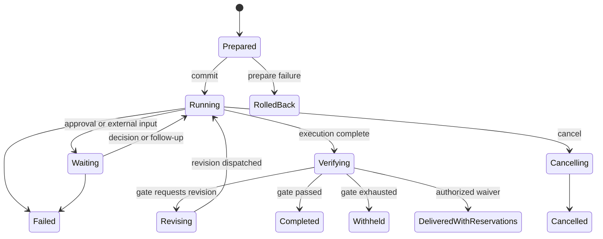
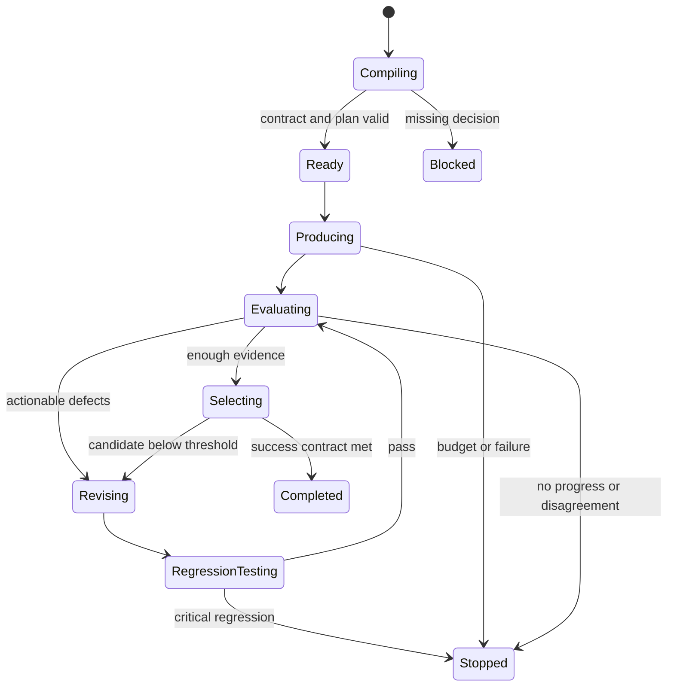

# Máquinas de estado

## 1. Run



Terminais: `rolled_back`, `completed`, `withheld`, `delivered_with_reservations`, `cancelled`, `failed`, `abandoned`. `delivered_with_reservations` nunca projeta `gate_passed`.

## 2. Target chains

| Target | Dispatch | Evidência mínima | Gate | Terminal |
|---|---|---|---|---|
| Business | `dispatch_business` | invocation ou child Run | obrigatório em entrega | terminal discriminado |
| Squad | `dispatch_squad` | workflow ou agent terminal | obrigatório em entrega | terminal discriminado |
| `agent-x` | `dispatch_agent_x` | AgentHandle terminal | obrigatório em entrega | terminal discriminado |

Fases empresariais só são obrigatórias quando o workflow as declara. Child Run não satisfaz automaticamente obrigações do parent.

## 3. Artifact revision

```text
declared → staged → hashed → verified → gated → published
                           ↘ rejected
```

Uma revision publicada é imutável. Correção cria nova revision. Publish externo registra origem, destino e digest após publicação.

## 4. Gauntlet



O controller avalia stop conditions antes de cada fan-out e depois de cada evaluation. Cost reservation precede dispatch.

## 5. Project

```text
planned → materializing → active → archived
                  ↘ failed
legacy_discovered → adoption_planned → active
```

Abrir Project legado não muda estado. Adoption exige preview, `plan_hash`, revalidação e execução idempotente.

## 6. Conversation e command

Conversation: `active → archived`; fork cria outra Conversation com ancestry. Message aceita é imutável. Correction é nova Message.

Command: `received → authorized → accepted → executing → succeeded|failed|cancelled`. Repetir idempotency key com payload igual retorna receipt anterior. Payload divergente retorna conflito.

## 7. Negotiation

```text
discovering → probing → filtering → ranking → planned → executing
                           ↘ incompatible
                                     ↘ awaiting_approval → rejected|planned
```

Todo fallback volta a `filtering`. Nenhum fallback pula policy, modality ou capability checks.
